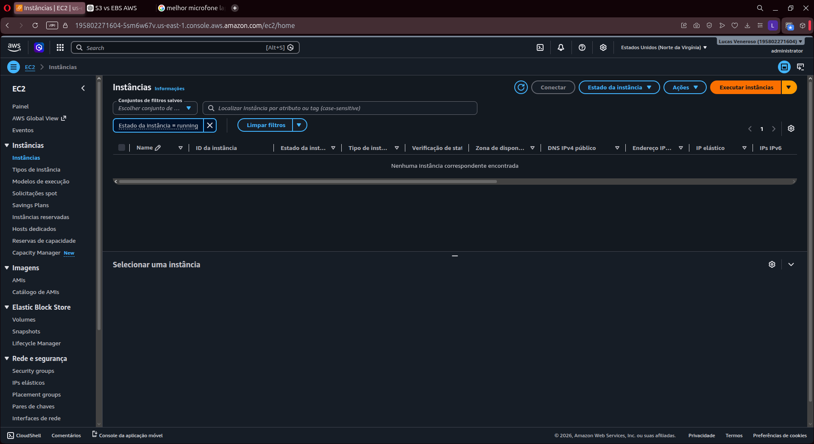
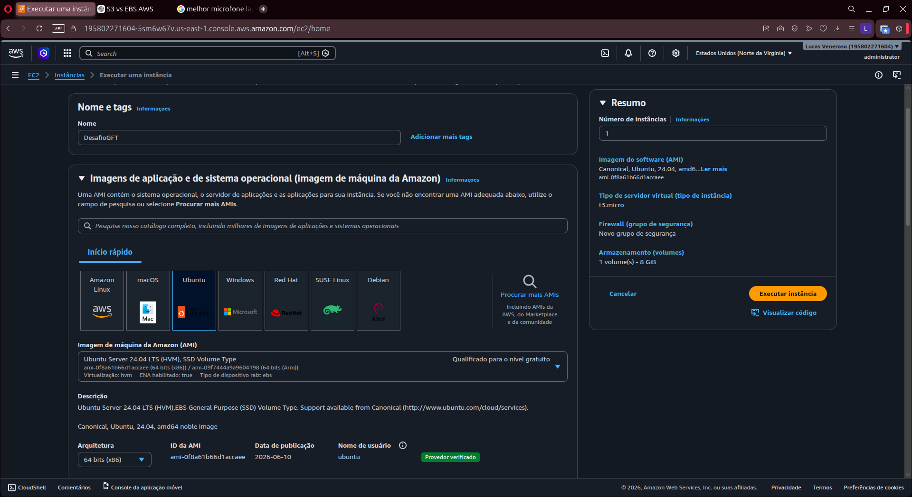
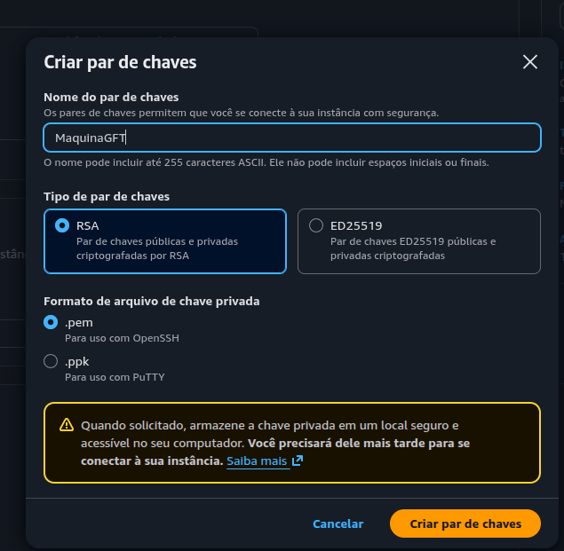
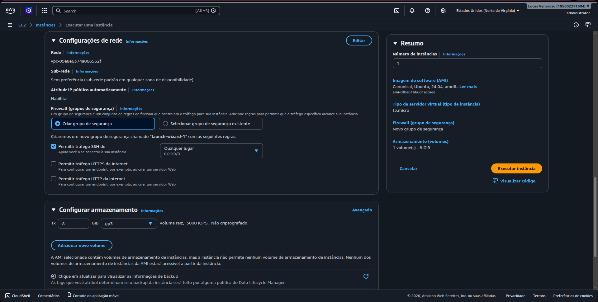
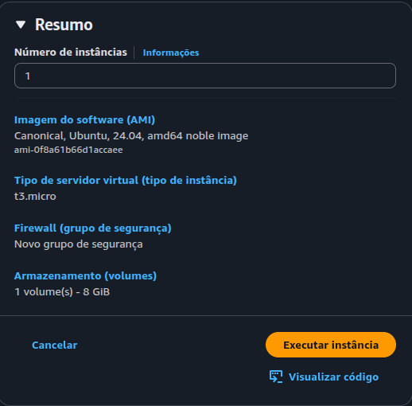
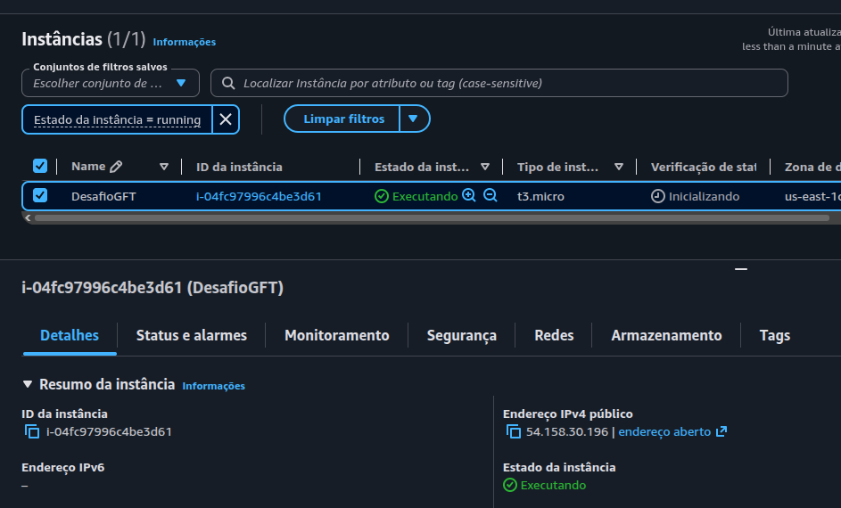

# Desafio AWS: Gerenciamento de Instâncias EC2 (Bootcamp GFT / DIO)

Este repositório foi criado para documentar meu primeiro laboratório prático no ecossistema da AWS, focado no provisionamento e gerenciamento de uma instância **Amazon EC2**. 

Estudar a teoria da nuvem é uma coisa, mas abrir o console e subir uma infraestrutura do zero expande a mente de um jeito absurdo. Entender como as peças se encaixam — do sistema operacional escolhido até as regras finas de rede e segurança — mudou totalmente a minha percepção de como as plataformas globais funcionam.

---

## O Passo a Passo da Implementação

### 1. O Painel Inicial
Tudo começou na estaca zero, com o dashboard do EC2 limpo, pronto para receber a primeira máquina virtual.

### 2. Configurações Básicas da Instância
Para esse desafio, batizei a máquina de `DesafioGFT` e selecionei uma AMI do **Ubuntu Server 24.04 LTS** (arquitetura x86 de 64 bits), aproveitando os recursos elegíveis para a camada gratuita (*Free Tier*). O tamanho escolhido foi a clássica instância `t3.micro`.

### 3. Segurança e Autenticação (Par de Chaves)
Para garantir que o acesso ao servidor seja totalmente protegido, criei um par de chaves RSA chamado `MaquinaGFT`, gerando o arquivo privado `.pem`. Sem essa chave, ninguém entra no servidor.

### 4. Arquitetura de Rede e Firewall (Security Groups)
Aqui foi onde a lógica de infraestrutura ficou interessante. Configurei as definições de rede dentro da VPC padrão e criei um novo **Security Group** personalizado. A regra de ouro foi habilitar o tráfego SSH vindo de qualquer lugar (porta 22) para que a máquina ficasse acessível remotamente. Além disso, configurei o armazenamento padrão com um volume raiz de 8 GiB do tipo gp3.

### 5. Revisão Geral do Setup
Antes de dar o "start", uma última checada no resumo dos recursos que seriam criados para garantir que tudo estava dentro do planejado.

### 6. Máquina Online e Pronta pro Combate
Instância provisionada com sucesso! O console confirmou o status como **Running** (Executando) e gerou o IP público correspondente.

---

## Insights e Aprendizados

* **O Poder do Isolamento:** Ver como o Security Group funciona como um firewall dedicado direto na instância me fez entender na prática o conceito de segurança na nuvem. Se a porta SSH não estivesse aberta ali, a máquina estaria completamente blindada contra acessos externos.
* **Aventuras via SSH:** Com o arquivo `.pem` baixado e o IP público em mãos, fui um pouco além do básico do laboratório e me aventurei a conectar no terminal da máquina via **SSH**. Ver a resposta do servidor Linux remoto aceitando a conexão direto da minha máquina local foi de longe a melhor parte da experiência. 
* **Escalabilidade:** O fato de podermos escolher e mudar o tipo de instância com alguns cliques deixa claro por que o mercado migrou em massa para a nuvem. É infraestrutura sob demanda pura.

Esse laboratório me deu a base real de computação que eu precisava. Agora o foco é continuar avançando nas trilhas de Cloud e DevOps! 🚀
